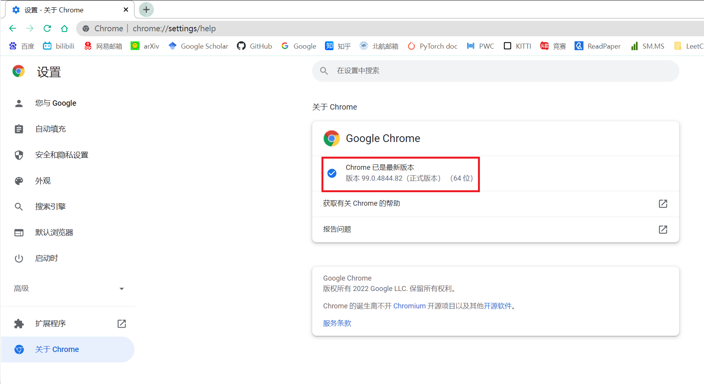

# 北航场馆预约系统Python+Selenium自动化脚本

An automatic Python script using selenium for the BUAA reservation system.
为了给脚本设置一些使用门槛，此Readme文档将用英文撰写（我知道这难不倒CS学生）。

# Features

- Totally automatic: *SLEEPS WELL.* You'll wake up with a notice that a court for you has been **reserved and paid**.
- Explicit waiting: *YOU SLEEP, BROWSERS DON'T.* A button shall be clicked when it's ready, which is defined by your network ability, rather than `time.sleep()`.
- Priority list: *DO IT WHEN IT'S GREEN.* you can make your own priority list of which court should be booked first. 
- Debugging mechanisms: there are a few circumstances that are extremely unfriendly to the automatic scripts. However, this script would counterback if it encounters them.

**Be warned, this script requires you to enter your SSO & Alipay account's usernames & passwords to achieve fully automation, be sure you run the script in a secure environment.**


# Installation
This project is based on Python=3.7.11. For ease of use, I highly recommend you to create a new environment using conda/miniconda.
```bash
conda create -n cgyy python=3.7 -y
conda activate cgyy
```

Then, install the requirements using files with specified versions. Use 'tab' wisely to avoid any typo mistakes (or just copy to clipboard).

```bash
pip install -r requirements.txt
```

To be specific, I used `selenium==4.1.3` with Google Chrome driver, `pillow==9.0.1`, `numpy==1.21.5`, `scikit-image==0.19.2` and `pyyaml==6.0`. And I also tried `pytesseract` to recognize the captcha code, but it in fact went very south.

# Usage

- Firstly download the Chrome Driver according to your Chrome browser's version. Check your version with `Settings --> About Chrome`, e.g. I'm 
99.0.4844.82 here.



- Then [download the chrome driver](https://chromedriver.storage.googleapis.com/index.html) to the specific version of your browser's. Replace it with the one provided in the repo if it's unmatched.

You could try with other browser's driver (e.g. Firefox, Edge, Safari, etc.). See compatibility with other browser and driver download links here: [Selenium Documentation](https://www.selenium.dev/documentation/webdriver/getting_started/install_drivers/#quick-reference). Normally, just replace the driver with your matched one and it should work as well.

- Write you own config in the 'configs' folder, which in this version I named it 'default.yaml'. Fill out some information right before you use the script:
1. Your SSO & Alipay account's usernames & passwords. **Be warned again, please make sure your environment is safe!**
2. The reservation time & priority list. It is represented by the beginning of an hour e.g. `reservation time: [19, 20]` means you're reserving 19:00~21:00. It might be a bug that the reservation system prevents you from reserving non-continuous time like [19, 21] which would be invalid, forcing you to select only either of the blocks.
3. **[Optional]** By default, the script chooses the first companion candidate showing in the default config file. If you would like to choose other candidate(s), revise the index of label ranging from 1 to n. For example, `candidate: 2` means choosing the secondary candidate. if you want to choose more of the candidates, check the related codes in `cgyy.py` line 80.
- **[Optional]** You can use the script just for reservation, but pay the fees manually (in 10 minutes). If in this case, just comment `cgyy.py` line 175 and leave the alipay username & password blank, then you can pay the fees manually using QR codes through multiple payment channels.
- Simply run the code with `python cgyy.py`. Or you could use other IDEs like Pycharm to run and see how each line works.

# TODO

- An automatic framework. Hopefully, the main python script should only have for-loops and the YAML file decides which button to click, which and where the keys to send.
- A locking mechanism. If there is a locking mechanism that will allow the script to just load the configuration but cannot access it, this whole process could be significantly safer and easier to widely use.
- Refinement. The codes can be organized better. I will reorganize it with when the automatic framework is constucted.
- Other functions. For instance, a looping mechanism that checks if there are any cancellation of a preset time; a longer/priority list of reserved time for people who accept multiple time choices; other debugging mechanisms like what if others locked a court where the script sees it available due to network latency...and so on.

# Version logs

- 2022/03/15: Making new directories and start coding.
- 2022/03/16: Ran a few tests. Basic functions are fine, but only supports manual payment at this moment.
- 2022/03/17: First test and the result is inspiring. However, an error occurred when sending the alipay password. ***Created this repo.***
- 2022/03/18: Second test result showing that the login shouldn't be too early or it will require re-login when paying. ***Uploaded ver 1.0, mainly basic modules.***
- 2022/03/19: Third test with an unexpecting crashdown of "buaa payment temporarily unavailable" happened.
- 2022/03/20: Fourth test with a huge success yet the crashdown didn't occur.
- 2022/03/21: Fifth test with another huge success as the confirming message was delayed for 4 minutes that seemingly proved the debugging mechanism worked. ***Uploaded ver 1.1, fixing multiple bugs occurred in previous tests and adding this ReadMe doc.***
- 2022/03/22: Sixth test encountered an error of loading pages, which is really wierd. Might be the network problem. ***Uploaded ver 1.2, adding yaml-load modules and revising the usage part of this doc.***

# License

This Repo is released under [MIT License](https://rem.mit-license.org/).